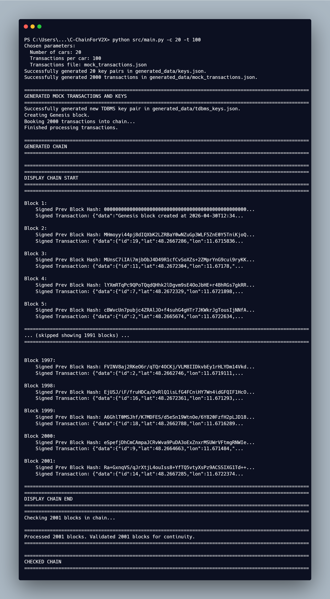

# C-ChainForV2X

An initial implementation of the C-Chain system for secure logging and verification of V2X (Vehicle-to-Everything) telemetry, according to the protocol described in C-ChainPaper.pdf.

## Overview

Unlike traditional blockchains that suffer from probabilistic finality, high latency and poor scalability, C-chain addresses these metrics critical to V2X communication via a TDBMS protocol that allows immediate settlement of tamper-proof V2X transactions for:
   - Forensics: Non-repudiable evidence for accident reconstruction.
   - Diagnostics: Verifiable telemetry history for sensor and hardware auditing.
   - Coordination: A cryptographically ordered "source of truth" for real-time traffic orchestration.
  
## Core Features

- Strict Serialization: Every block $T_n$ is cryptographically linked to $h(T_{n-1})$ via the TDBMS signature $\sigma_s$.
- Identity Binding: Telemetry is bound to the sender and its logging to the TDBMS via RSA-PSS signatures, ensuring non-repudiation on both levels.
- ACID Compliance: Guaranteed by the usage of an appropriate TDB and application layer TDBMS.


Features discussed so far have only been partially implemented. Details below, however, describe the current state of implementation.


## Architecture & Control Flow

### Components Summary

1. **Utilities**
   - `hash_utilities.py`: SHA-256 canonicalization and hashing
   - `key_utilities.py`: RSA-PSS signing and verification (π(σ(h(d))) ?= h(d))
   - `tdb_utilities.py`: SQLite database management
   - `display_chain.py`: Chain visualization and inspection

2. **Generators**
   - `transaction_and_key_generator.py`: Generation of V2X transactions and RSA key pairs per vehicle
   - `chain_generator.py`: 
     - Transaction validation: πU(σU(h(d))) ?= h(d) in T = [d, σU(h(d))]
     - TDBMS signing: σS(T) = [d, σS(σU(h(d)))]
     - Chain creation: Using blocks of format: [n+1, σS(h(Tn)), σS(T)]

3. **Verification**
   - `chain_checker.py`: Chain continuity verification: πS(σS(h(prev_block))) ?= h(prev_block) per block
  
4. **Storage**
   - `generated_data/keys.json`: Vehicles' RSA key pairs
   - `generated_data/tdbms_keys.json`: TDBMS RSA key pair
   - `generated_data/mock_transactions.json`: Generated V2X transaction data
   - `generated_data/V2X_chain.db`: SQLite database containing the chain


### Flow Summary

1. **Transaction Generation**:  V2X transactions containing:
   - Vehicle ID
   - GPS coordinates (lat, lon)
   - Velocity
   - Timestamp

2. **Chain Creation by TDBMS**:
   - Verification of vehicle signatures using respective public keys
   - Signing of the transaction with TDBMS private key
   - Creation of a new block linked to the previous block in the existing chain

3. **Chain Display & Verification**:
   - Console display of first and last 5 blocks
   - Verification of links between blocks 

### Block Structure
   
   ```json
   Non-genesis blocks:
   {
     "id": block_number,
     "signed_prev_block_hash": σS(h(previous_block with id = (block_number - 1))),
     "signed_transaction": {
       "data": {"id": vehicle_id, 
       "lat": latitude, 
       "lon": longitude, 
       "vel": velocity, 
       "ts": timestamp},
       "signature": σS(h(σU(h(data))))
     }
   }

   Genesis block:
   {
     "id": 1,
     "signed_prev_block_hash": "0" * 64,
     "signed_transaction": {
       "data": "Genesis block created at (YYYY-MM-DDTHH:MM:SS.ssssss) by owner of public key (public_key of TDBMS: πS)",
       "signature": σS(h(data))
     }
   }
   ```

## Usage

```python
# Available arguments (all optional):
#   -f: transactions output filename (default: mock_transactions.json)
#   -c: number of cars (default: 10)
#   -t: number of transactions per car (default: 10)

# An example to generate mock transactions, process them into the chain, and verify the chain
python src/main.py -f transactions.json -c 50 -t 20


# Alternatively, use:
python src/main.py --help
```

## Console Output Example



## Implementation Progress

### Steps Implemented

    The current implementation covers Steps 1-3 of the TDBMS protocol (page 9 of the paper):
    ✅ Verifying T = [d, σU(h(d))] by checking πU(σU(h(d))) ?= h(d)
    ✅ Certification of T via σS(T) = [d, σS(σU(h(d)))]
    ✅ Appending T into blocks as [n+1, σS(h(Tn)), σS(T)]
   
### Scope for Further Work

    ⚠️ Checking blocks in chain for not just continuity, but also payload integrity via πS(σS(σU(h(d)))) ?= σU(h(d)) while allowing RSA-PSS for σU(h(d))
    ⚠️ UDB with CryptIDs
    ⚠️ Simulation of nodes via SUMO instead of loading transactions from a file
    ⚠️ Private Messages
    ⚠️ Steps 4-5 of the TDBMS protocol (TC synchronization at cars)
    ⚠️ Concurrency control
    ⚠️ Verification of protocol and testing
    ⚠️ Atomicity
    ⚠️ PostgreSQL 
    ⚠️ Performance optimization and benchmarking