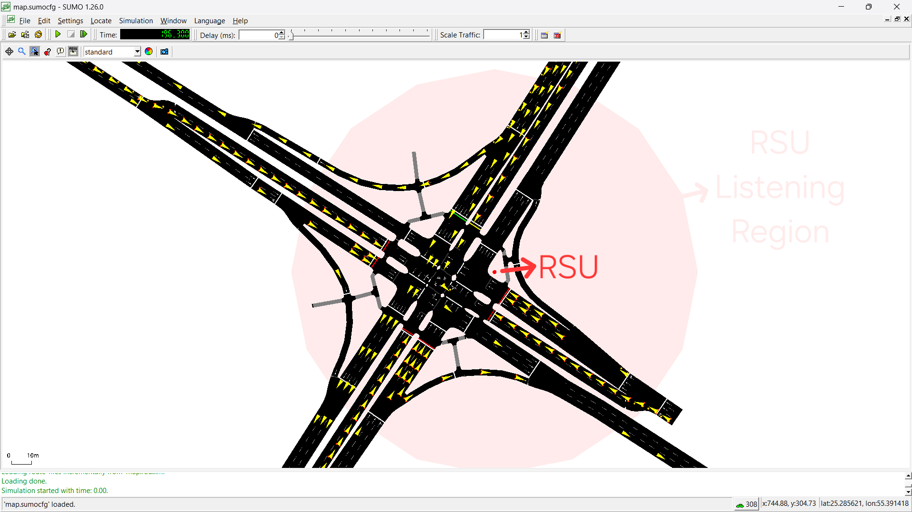

# SUMO Simulations for C-Chain V2X Testbench

This directory contains SUMO (Simulation of Urban Mobility) scenarios designed to serve as a testbench for evaluating C-Chain implementations in V2X (Vehicle-to-Everything) communication scenarios.

## 🚦 Overview

The SUMOSims folder provides realistic traffic simulation environments that can be used to:
- Test C-Chain blockchain performance under varying traffic loads
- Validate V2X communication protocols
- Analyze and benchmark transaction processing in vehicular networks



## 📁 Current Scenarios

### IntersectionScenario1
A four-way traffic-light controlled intersection scenario from real-world OSM map data with traffic flows from all directions and realistic vehicle dynamics.

## 🚀 Quick Start

### Step 1: Clone and Setup
```powershell
# Clone the repository (if not already done)
git clone <repository-url>
cd SUMOSims

# Install Python dependencies
pip install -r requirements.txt
```

### Step 2: Run Scenario Setup
```powershell
# Navigate to the scenario directory
cd IntersectionScenario1

# Run the PowerShell setup script
.\setup.ps1
```

### Step 3: Launch Simulation GUI
```powershell
# Start SUMO with GUI
sumo-gui -c map.sumocfg
```

## 🔧 Customization

`map.flow.xml` contains:
- Vehicle properties
- Flow probabilities per direction
- Simulation time windows
- Departure behavior

`map.net.xml` contains:
- Traffic light logic and timing

## 🔍 Integration with C-Chain

### V2X Communication Setup

The scenario includes an RSU (Roadside Unit) listener (red dot) that monitors vehicles entering its communication range (transparent red circle):

**RSU Listener (`rsu_listener.py`)**
- Event-driven TraCI script that detects vehicles entering RSU radius
- Extracts vehicle telemetry: ID, speed, position (lat/lon or x/y), timestamp
- Configurable RSU position and listening range (via `rsu.add.xml`)

**Usage:**
```powershell
# Ensure SUMO simulation is configured with RSU
# Run the listener (starts SUMO GUI automatically)
python rsu_listener.py
```

**Integration with C-Chain:**
TBD
